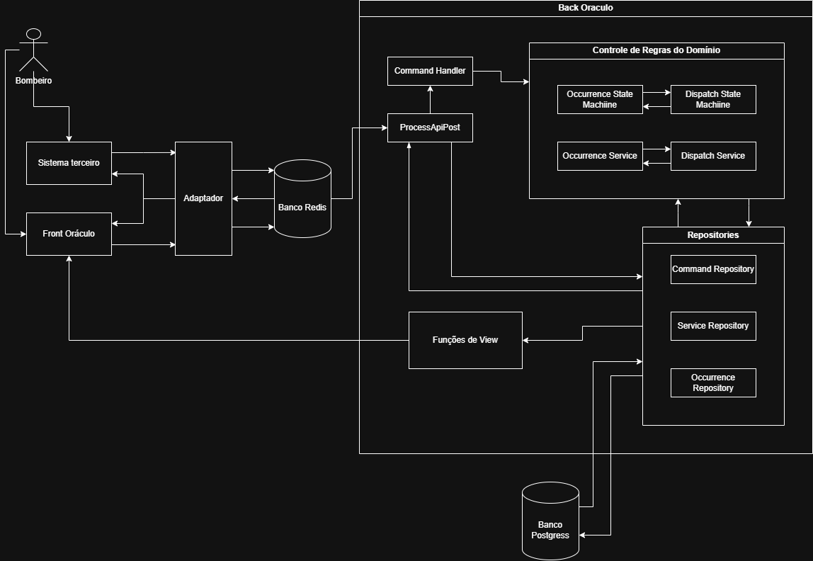

# 🧪 Sistema de Gestão de Ocorrências — Corpo de Bombeiros
Este repositório contém a implementação do desafio técnico de **Sistema de Gestão de Ocorrências**, inspirado em um cenário real de corporação pública crítica.


A solução foi construída com:

* **Backend:** Laravel (PHP 8+)
* **Banco de Dados:** PostgreSQL
* **Fila:** Redis (processamento assíncrono obrigatório)
* **Frontend:** React
* **Orquestração:** Docker + Docker Compose
---
# 🚀 Como rodar backend e frontend
## ✅ Pré-requisitos

* Docker
* Docker Compose

Não é necessário instalar PHP, Node ou Redis localmente.

Clonar os repositórios: 
```bash
git clone https://github.com/BCPHERO11/OlhoDeThundera_frontend.git
```
```bash
git clone https://github.com/BCPHERO11/OlhoDeThundera_backend.git
```
⚠️ **Lembre-se de duplicar a env.example para .env no back** ⚠️

---
## 🐳 Subindo o ambiente
```bash
docker compose up -d --build
```
Isso tanto no repositório de front como de backend irá subir:

* `app` → Laravel (API)
* `worker` → Worker da fila (`php artisan queue:work`)
* `db` → PostgreSQL
* `redis` → Redis
* `frontend` → React

## 🔧 Backend

Acessar o container:
```bash
docker exec -it back_thundera bash
```

Instalar as dependências do backend:
```bash
composer install
```

Rodar migrations:
```bash
php artisan migrate
```

Iniciar o worker (opcional, apenas se você **não** estiver usando o serviço `worker` do `docker-compose.yml`):

```bash
php artisan queue:work
```

## Acessos
A aplicação React estará disponível em:

```
http://localhost:5173
```

A API estará disponível em:

```
http://localhost:8070/api
```


---
# 📦 Desenho de arquitetura



A arquitetura foi projetada para atender explicitamente aos requisitos de:

* Processamento assíncrono (`202 Accepted`)
* Idempotência forte com `Idempotency-Key`
* Controle de concorrência
* Auditoria completa
* Separação clara entre aceitação e execução

A API apenas **aceita** o comando e o registra.
O processamento real ocorre em background via **worker**.
---

# 📡 Estratégia de integração externa


Endpoint:

```
POST /api/integrations/occurrences
```

Headers obrigatórios:

```
X-API-Key
Idempotency-Key
```

Fluxo:

1. Valida autenticação
2. Valida payload
3. Formata payload dentro de um comando
4. Enfileira na fila com Redis

Resposta HTTP:

```
202 Accepted
```

A decisão de usar `202` está alinhada com o significado formal: requisição aceita, mas processamento não concluído.

---

# 🔁 Estratégia de idempotência
A estratégia de indepotência adotada foi utilizando a verificação através do próprio Redis.

Primeiramente é gerada uma string do tipo
```
idempotency_key + tipo do comando + id da ocorrencia
```
⚠️ **Obs: caso a ocorrência esteja vindo do sistema terceiro é utilizado o id externo** ⚠️ 

Em seguida é utilizado um comando no redis pra settar uma chave exclusiva no cache pelo próximo minuto.
```php
$result = Redis::set($key, now()->toDateTimeString(), 'NX', 'EX', 60 * 60)
```

Caso a chave já tenha sido cadastrada e esteja em cache ainda o set retornará false o que tira do fluxo e gera um response de 409 com a mensagem de que a solicitação já foi recebida

---

# 🔀 Estratégia de concorrência

O sistema se protege contra:

* Eventos simultâneos
* Transições inválidas de estado

## Proteção contra eventos simultâneos
O sistema faz uso de 2 métodos principaos para evitar falahs por eventos simultâneos

* Uso do método BLPOP do Redis ao tirar um comando da fila. Pois ele garante o lock impedindo vários workers fazerem leituras simultâneas.
* Uso da função Laravel ->lockForUpdate no momento de registro em disco o que também irá garantir previsibilidade em um ambiente com mútiplos workers

## Proteção contra transições inválidas de estado
Foi feita através da implementação de máquinas de estados para regular todas as transições válidas tanto dos Occurrences quanto dos Dispatches

---
# 🚫 Pontos de falha e recuperação
Não foi implementado um método de recuperação de comandos perdidos, então em caso de falhas, qualquer falhas em qualquer etapa do commando o sistema realiza rollback das mudanças feitas e registra o motivo dentro do próprio comando.

---
# 📝 Estratégia de Auditoria

Toda mudança de status em:

* Occurrence
* Dispatch

Gera registro na tabela `audit_logs` contendo:

* before
* after
* command
* indempotency_key

Isso garante rastreabilidade completa.

---
# 🚧 O que Ficou de Fora

* A rota de Get acabou tendo algum problema e não funciona
* O front acabou virando uma página estática devido ao problema de criar rotas get
* Autenticação com OAuth/JWT
* Sistema de permissões por perfil
* Observabilidade completa (tracing distribuído)
* Dashboard operacional avançado
* Cache para leitura

---

# 🔮 Evolução na Corporação

Possíveis evoluções:

* Integração com sistemas estaduais
* API pública de consulta
* Métricas operacionais (SLA, tempo resposta)
* Georreferenciamento
* Painel em tempo real
* Multi-tenancy para batalhões
* Event streaming (Kafka)

---
